  

    
  

  
  <h1 align="center">
    
    Hi, I'm <strong>Nafiz Kamal Talha</strong>
  </h1>
  
  

    <picture>
      <source media="(prefers-color-scheme: dark)" srcset="./scanner-dark.svg">
      <source media="(prefers-color-scheme: light)" srcset="./scanner-light.svg">
      
    </picture>
  

  

    <picture>
      <source media="(prefers-color-scheme: dark)" srcset="https://readme-typing-svg.herokuapp.com?size=30&duration=3000&color=00F7FF&center=true&vCenter=true&width=900&lines=Nafiz+Kamal+Talha;Full+Stack+MERN+Engineer;Secure+System+Builder;React+%7C+Node+%7C+MongoDB;Clean+Code+%7C+Scalable+Architecture">
      <source media="(prefers-color-scheme: light)" srcset="https://readme-typing-svg.herokuapp.com?size=30&duration=3000&color=3B82F6&center=true&vCenter=true&width=900&lines=Nafiz+Kamal+Talha;Full+Stack+MERN+Engineer;Secure+System+Builder;React+%7C+Node+%7C+MongoDB;Clean+Code+%7C+Scalable+Architecture">
      
    </picture>
  

  <h3>MERN Developer | Security Learner | Problem Solver</h3>

 

<picture>
  <source media="(prefers-color-scheme: dark)" srcset="./nafiz-lanyard.svg">
  <source media="(prefers-color-scheme: light)" srcset="./nafiz-lanyard-light.svg">
  
</picture>

<h2> About Me</h2>

I am a <strong>Full Stack MERN Developer</strong> focused on building <strong>scalable, secure, and production-ready web applications.</strong>

<strong>Currently focused on:</strong>

<ul>
  <li> Building modern React applications</li>
  <li> Developing REST APIs using Node.js & Express</li>
  <li> Designing efficient MongoDB & SQL database systems</li>
  <li> Learning Cybersecurity fundamentals & Kali Linux</li>
  <li> Applying secure coding principles in web applications</li>
</ul>

  
  
   
  

 

  <h2> Tech Stack</h2>
  

    <strong>Languages:</strong>  
    <picture>
      <source media="(prefers-color-scheme: dark)" srcset="https://skillicons.dev/icons?i=c%2Ccpp%2Cjava%2Cjs%2Cpython%2Ckotlin&theme=dark">
      <source media="(prefers-color-scheme: light)" srcset="https://skillicons.dev/icons?i=c%2Ccpp%2Cjava%2Cjs%2Cpython%2Ckotlin&theme=light">
      
    </picture>
  

  

    <strong>Frontend & Backend:</strong>  
    <picture>
      <source media="(prefers-color-scheme: dark)" srcset="https://skillicons.dev/icons?i=react%2Cnextjs%2Ctailwind%2Cbootstrap%2Cnodejs%2Cexpress&theme=dark">
      <source media="(prefers-color-scheme: light)" srcset="https://skillicons.dev/icons?i=react%2Cnextjs%2Ctailwind%2Cbootstrap%2Cnodejs%2Cexpress&theme=light">
      
    </picture>
  

  

    <strong>Databases:</strong>  
    <picture>
      <source media="(prefers-color-scheme: dark)" srcset="https://skillicons.dev/icons?i=mongodb%2Cmysql%2Cpostgres%2Cfirebase&theme=dark">
      <source media="(prefers-color-scheme: light)" srcset="https://skillicons.dev/icons?i=mongodb%2Cmysql%2Cpostgres%2Cfirebase&theme=light">
      
    </picture>
  

  

    <strong>Tools:</strong>  
    <picture>
      <source media="(prefers-color-scheme: dark)" srcset="https://skillicons.dev/icons?i=git%2Cgithub%2Cvercel%2Cpostman%2Clinux%2Cvscode%2Cdocker%2Caws&theme=dark">
      <source media="(prefers-color-scheme: light)" srcset="https://skillicons.dev/icons?i=git%2Cgithub%2Cvercel%2Cpostman%2Clinux%2Cvscode%2Cdocker%2Caws&theme=light">
      
    </picture>
  

 

  <h2> Competitive Programming Profiles</h2>
  
  
  
  
  
  
  

 

  <h2> GitHub Analytics</h2>
  
  <picture>
    <source media="(prefers-color-scheme: dark)" srcset="https://github-readme-streak-stats.herokuapp.com/?user=Nafiz-365&theme=tokyonight&hide_border=true">
    <source media="(prefers-color-scheme: light)" srcset="https://github-readme-streak-stats.herokuapp.com/?user=Nafiz-365&theme=default&hide_border=true">
    
  </picture>
  &nbsp;
  <picture>
    <source media="(prefers-color-scheme: dark)" srcset="https://github-profile-summary-cards.vercel.app/api/cards/profile-details?username=Nafiz-365&theme=tokyonight">
    <source media="(prefers-color-scheme: light)" srcset="https://github-profile-summary-cards.vercel.app/api/cards/profile-details?username=Nafiz-365&theme=default">
    
  </picture>
  &nbsp;
  <picture>
    <source media="(prefers-color-scheme: dark)" srcset="https://github-profile-summary-cards.vercel.app/api/cards/repos-per-language?username=Nafiz-365&theme=tokyonight">
    <source media="(prefers-color-scheme: light)" srcset="https://github-profile-summary-cards.vercel.app/api/cards/repos-per-language?username=Nafiz-365&theme=default">
    
  </picture>

    

  <picture>
    <source media="(prefers-color-scheme: dark)" srcset="https://github-readme-activity-graph.vercel.app/graph?username=Nafiz-365&theme=tokyo-night&hide_border=true">
    <source media="(prefers-color-scheme: light)" srcset="https://github-readme-activity-graph.vercel.app/graph?username=Nafiz-365&theme=default&hide_border=true">
    
  </picture>

    

  <!-- 🐍 GitHub Snake Animation -->
  <picture>
    <source media="(prefers-color-scheme: dark)" srcset="https://raw.githubusercontent.com/Nafiz-365/Nafiz-365/output/github-snake-pink.svg">
    <source media="(prefers-color-scheme: light)" srcset="https://raw.githubusercontent.com/Nafiz-365/Nafiz-365/output/github-snake.svg">
    
  </picture>

 

  <h2> Connect With Me</h2>
  
  
  
  
  
    
  

